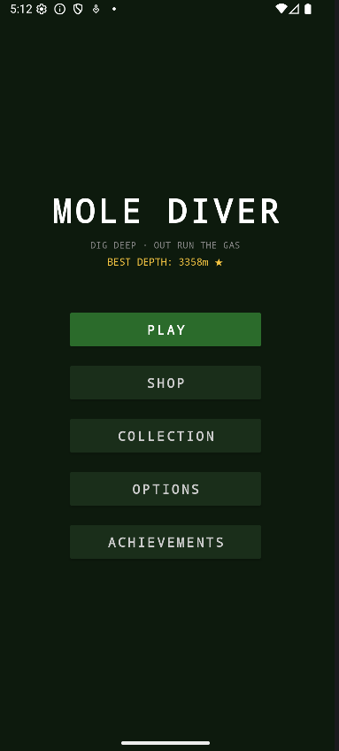
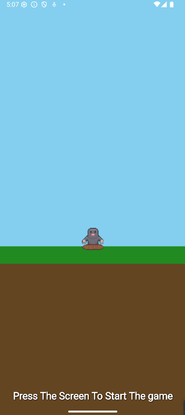
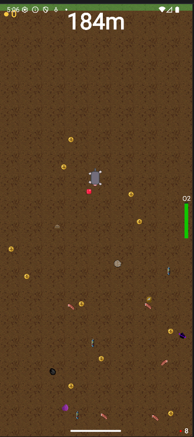
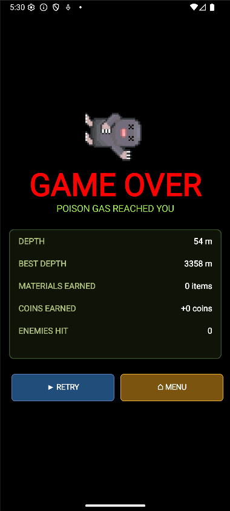
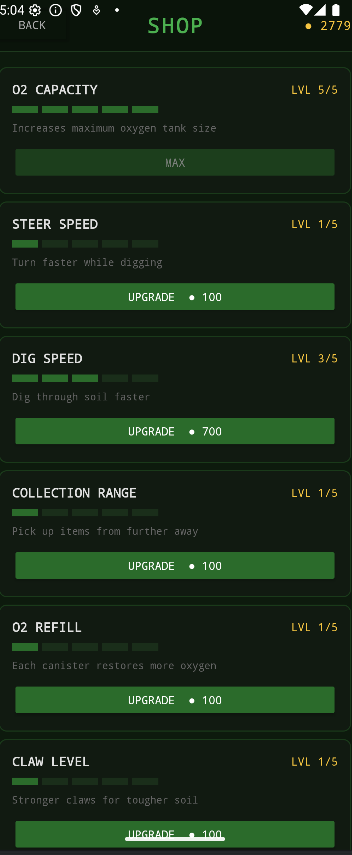
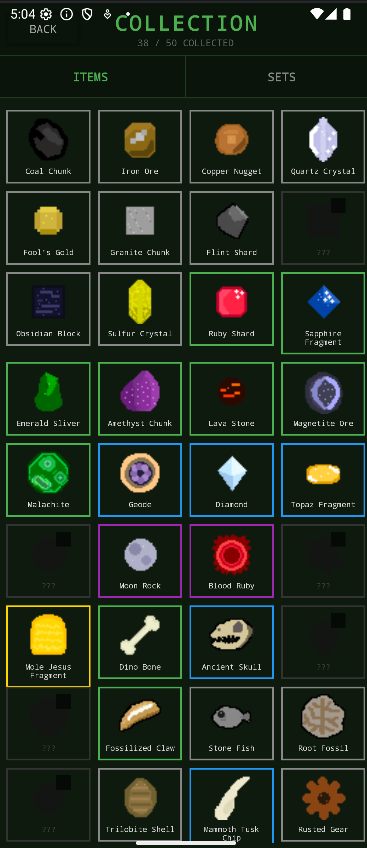
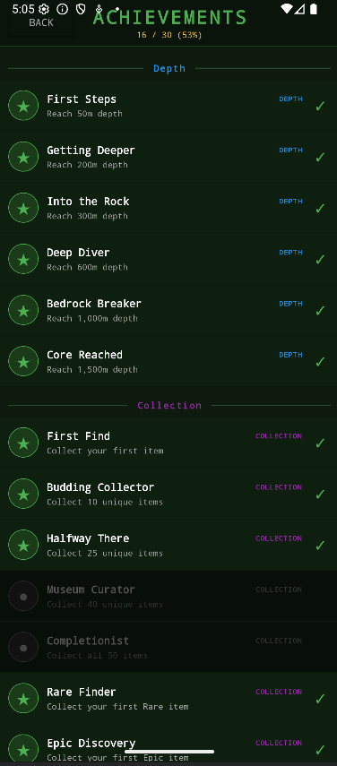
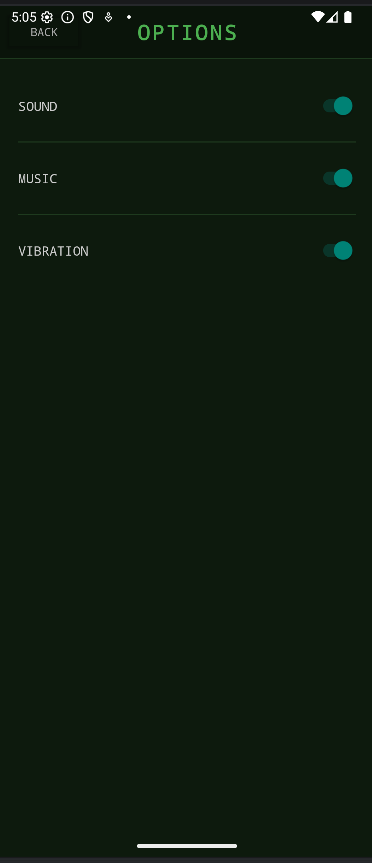

# Mole Diver

> An Android endless-diver where you race a poison gas cloud to the Earth's core, collecting rare materials and upgrading your mole along the way.

---

## Table of Contents

1. [Story](#story)
2. [Controls](#controls)
3. [Screenshots](#screenshots)
4. [Features](#features)
5. [Enemies](#enemies)
6. [Items & Rarities](#items--rarities)
7. [Item Sets](#item-sets)
8. [Upgrades](#upgrades)
9. [Achievements](#achievements)
10. [Technical Architecture](#technical-architecture)
11. [Build Instructions](#build-instructions)
12. [Asset Pipeline](#asset-pipeline)
13. [UI Flow](#ui-flow)
14. [Known Limitations](#known-limitations)

---

## Story

A meteorite has struck the Earth and released a deadly poison gas that spreads downward through the soil. The only hope for saving the planet is to reach **Mole Jesus**, a powerful figure resting at the Earth's core (4,000m deep).

The player controls a mole that must dig down through six underground layers, outrunning the descending gas cloud, collecting rare materials, dodging enemies, and grabbing oxygen canisters before asphyxiating.

---

## Controls

| Action | Input |
|---|---|
| Dig left / curve left | Tap left half of screen |
| Dig right / curve right | Tap right half of screen |
| Dig straight down | No input (default trajectory) |

The mole rotates its digging angle incrementally, allowing the player to curve back upward if needed — but the gas cloud always descends, so staying too shallow is deadly.

---

## Screenshots

| | |
|---|---|
|  |  |
|  |  |
|  |  |
|  |  |

---

## Features

- **Layered world** — six geological layers, each with a distinct color palette and increasing depth pressure
- **Gas cloud mechanic** — a deadly gas descends at increasing speed; collecting materials accelerates the gas
- **50-item collection** — Common through Legendary rarities across Minerals, Fossils, Artifacts, and Hidden categories
- **7 item sets** — complete themed collections for permanent gameplay rewards
- **7 upgradeable stats** — persistent progression between runs (up to level 5 each)
- **30 achievements** — across Depth, Collection, Coins, Upgrades, Survival, and Sets categories
- **Sprite-based enemies** — three enemy types with directional sprites and separate hitboxes
- **Animated mole** — sprite-sheet walking animation with full 360° rotation
- **Background music** — adaptive volume (lowers on death, restores on retry)
- **Pickup SFX** — low-latency SoundPool for item/canister/coin collection
- **Game-over stats card** — shows depth, best depth, materials found, coins earned, enemies hit
- **Achievement flash** — newly unlocked achievements displayed on the game-over screen
- **Ending sequence** — reaching 4,000m triggers a win cutscene

---

## Enemies

| # | Type | Sprite | Screen Size | Behavior |
|---|---|---|---|---|
| 0 | Worm | `enemy_worm.png` | 48×48 px | Horizontal patrol |
| 1 | Beetle | `enemy_beetle.png` | 56×56 px | Horizontal patrol |
| 2 | Rock Crawler | `enemy_rock_crawler.png` | 64×64 px | Horizontal patrol |

Each enemy has a mirrored left-facing sprite pre-generated at load time using a horizontal Matrix flip. Contact with an enemy triggers a hit-flash effect and drains oxygen.

---

## Items & Rarities

### Rarity Table

| Rarity | Color | Coin Value | Base Drop Rate |
|---|---|---|---|
| Common | Grey `#888888` | 10 | 50% |
| Uncommon | Green `#4CAF50` | 30 | 30% |
| Rare | Blue `#2196F3` | 100 | 15% |
| Epic | Purple `#9C27B0` | 300 | 4% |
| Legendary | Gold `#FFD700` | 1000 | 1% |

Drop rates improve with the **Rarity Boost** upgrade (each level shifts −2% from Common, +0.5% to each other tier).

### Item Catalogue (50 items)

#### Minerals & Gems (25 items)
| ID | Name | Rarity |
|---|---|---|
| 1 | Coal Chunk | Common |
| 2 | Iron Ore | Common |
| 3 | Copper Nugget | Common |
| 4 | Quartz Crystal | Common |
| 5 | Fool's Gold | Common |
| 6 | Granite Chunk | Common |
| 7 | Flint Shard | Common |
| 8 | Limestone Block | Common |
| 9 | Obsidian Block | Common |
| 10 | Sulfur Crystal | Common |
| 11 | Ruby Shard | Uncommon |
| 12 | Sapphire Fragment | Uncommon |
| 13 | Emerald Sliver | Uncommon |
| 14 | Amethyst Chunk | Uncommon |
| 15 | Lava Stone | Uncommon |
| 16 | Magnetite Ore | Uncommon |
| 17 | Malachite | Uncommon |
| 18 | Geode | Rare |
| 19 | Diamond | Rare |
| 20 | Topaz Fragment | Rare |
| 21 | Black Opal | Rare |
| 22 | Moon Rock | Epic |
| 23 | Blood Ruby | Epic |
| 24 | Void Shard | Epic |
| 25 | Mole Jesus Fragment | Legendary |

#### Fossils (10 items)
| ID | Name | Rarity |
|---|---|---|
| 26 | Dino Bone | Uncommon |
| 27 | Ancient Skull | Rare |
| 28 | Petrified Egg | Rare |
| 29 | Amber with Bug | Rare |
| 30 | Fossilized Claw | Uncommon |
| 31 | Stone Fish | Common |
| 32 | Root Fossil | Common |
| 33 | Ancient Coin | Uncommon |
| 34 | Trilobite Shell | Common |
| 35 | Mammoth Tusk Chip | Rare |

#### Artifacts (10 items)
| ID | Name | Rarity |
|---|---|---|
| 36 | Rusted Gear | Common |
| 37 | Broken Watch | Uncommon |
| 38 | Old Boot | Common |
| 39 | Buried Treasure Chest | Epic |
| 40 | Strange Idol | Rare |
| 41 | Cracked Compass | Uncommon |
| 42 | Underground Shrine | Epic |
| 43 | Mole Helmet | Rare |
| 44 | Mystery Box | Epic |
| 45 | Mole Jesus Relic | Legendary |

#### Hidden (5 items — never drop from normal rolls)
| ID | Name | Rarity |
|---|---|---|
| 46 | Riccardo Statue | Legendary |
| 47 | Kasidet Statue | Legendary |
| 48 | Snow Dog Plushie | Legendary |
| 49 | White Cat Plushie | Legendary |
| 50 | Mole Plushie | Legendary |

---

## Item Sets

Complete all items in a set to claim a permanent reward.

| Set Name | Items Required | Reward |
|---|---|---|
| Legend of the Mole | 25, 45, 50 | 2× permanent coin multiplier |
| Deep Earth | 21, 22, 23, 24 | +15% material drop rate |
| The Digger's Toolkit | 36, 41, 37, 43 | +10% upgrade discount |
| Fool's Hoard | 1, 2, 3, 5 | Common items worth 2× coins |
| The Ancient World | 26, 27, 33, 35 | Fossil detector highlight |
| Collector's Nightmare | All 50 items | Golden mole skin + title |

---

## Upgrades

All 7 upgrades have 5 levels and persist between runs. Purchased from the Shop with coins earned in-game.

| Upgrade | Key | Effect |
|---|---|---|
| Oxygen Tank | `upgrade_oxygen` | Increases maximum oxygen capacity |
| Steer Speed | `upgrade_steer_speed` | How fast the mole rotates direction |
| Dig Speed | `upgrade_dig_speed` | Overall movement speed |
| Collection Range | `upgrade_range` | Radius for picking up nearby items |
| O2 Refill Rate | `upgrade_o2_refill` | How much oxygen each canister restores |
| Claw Strength | `upgrade_claw` | Bonus coins per material collected |
| Rarity Boost | `upgrade_rarity` | Shifts item drop table toward higher rarities |

---

## Achievements

30 achievements across 6 categories. Checked efficiently with a single SharedPreferences read at end-of-run and on screen resume.

### Depth
| # | Name | Requirement |
|---|---|---|
| 1 | First Steps | Reach 50m depth |
| 2 | Getting Deeper | Reach 200m depth |
| 3 | Into the Rock | Reach 300m depth |
| 4 | Deep Diver | Reach 600m depth |
| 5 | Bedrock Breaker | Reach 1,000m depth |
| 6 | Core Reached | Reach 1,500m depth |

### Collection
| # | Name | Requirement |
|---|---|---|
| 7 | First Find | Collect your first item |
| 8 | Budding Collector | Collect 10 unique items |
| 9 | Halfway There | Collect 25 unique items |
| 10 | Museum Curator | Collect 40 unique items |
| 11 | Completionist | Collect all 50 items |
| 12 | Rare Finder | Collect your first Rare item |
| 13 | Epic Discovery | Collect your first Epic item |
| 14 | Legendary Pull | Collect your first Legendary item |

### Coins
| # | Name | Requirement |
|---|---|---|
| 15 | Pocket Change | Earn 100 total coins (lifetime) |
| 16 | Saving Up | Earn 1,000 total coins (lifetime) |
| 17 | Rich Mole | Earn 10,000 total coins (lifetime) |
| 18 | Mole Millionaire | Earn 100,000 total coins (lifetime) |
| 19 | Big Haul | Earn 500+ coins in a single run |

### Upgrades
| # | Name | Requirement |
|---|---|---|
| 20 | First Upgrade | Purchase any upgrade |
| 21 | Fully Loaded | Max out any single upgrade to level 5 |
| 22 | Jack of All Trades | Upgrade all 7 stats at least once |
| 23 | Maxed Out | Max out all 7 upgrades to level 5 |

### Survival
| # | Name | Requirement |
|---|---|---|
| 24 | Close Call | Survive with less than 5% oxygen remaining |
| 25 | Oxygen Hoarder | Collect 10 O2 canisters in one run |
| 26 | Untouchable | Reach 200m without hitting any enemy |
| 27 | Bug Squasher | Hit 50 enemies total (lifetime) |

### Sets
| # | Name | Requirement |
|---|---|---|
| 28 | Set Starter | Complete your first item set |
| 29 | Set Collector | Complete 5 item sets |
| 30 | Legend | Complete the Legend of the Mole set |

---

## Technical Architecture

### Language & Platform
- **Language:** Java (Android SDK 21+)
- **Build system:** Gradle with Kotlin DSL (`build.gradle.kts`)
- **Min SDK:** 21 | **Target SDK:** 34

### Core Game Loop
`GameView extends SurfaceView implements SurfaceHolder.Callback` runs a dedicated thread at ~60 fps. Each tick calls `update()` then `draw()` with canvas locking.

### Key Classes

| Class | Responsibility |
|---|---|
| `GameView` | Entire game loop, physics, rendering, input, audio |
| `GameActivity` | Hosts `GameView`, handles lifecycle (pause/resume/destroy) |
| `PlayerData` | All `SharedPreferences` I/O (coins, upgrades, collection, achievements, best depth) |
| `ItemCatalogue` | 50-item definition table + weighted random-roll logic |
| `SetManager` | 7 set definitions + completion/progress queries |
| `AchievementManager` | 30 achievement definitions + batch check/unlock logic |
| `ShopActivity` | 7 upgrade purchase UI |
| `CollectionActivity` | Grid display of all 50 items with lock/unlock state |
| `AchievementsActivity` | Categorized achievement list with `BaseAdapter` (header + item rows) |
| `MainMenuActivity` | Entry point; best-depth display; achievement check on resume |
| `SplashActivity` | Animated splash before main menu |

### Audio
- **Background music:** `MediaPlayer` from `res/raw/background.mp3`, looping; volume lowers to 0.15 on death, restores to 0.4 on retry
- **Pickup SFX:** `SoundPool` (API 21 `SoundPool.Builder`) from `res/raw/item_pickup.mp3`; plays on O2 canister, coin, and item collection

### Data Storage
All player state is stored in a single named `SharedPreferences` file (`"mole_diver_prefs"`). Keys:

| Key | Type | Purpose |
|---|---|---|
| `best_depth` | float | All-time best depth in metres |
| `coins` | int | Current spendable coin balance |
| `lifetime_coins` | long | Running total for achievement checks |
| `lifetime_enemies_hit` | int | Lifetime enemy collisions |
| `max_run_coins` | int | Best single-run coin total |
| `max_run_canisters` | int | Most O2 canisters collected in one run |
| `close_call_triggered` | boolean | Set when oxygen drops below 5% |
| `untouchable_triggered` | boolean | Set when 200m reached without enemy hit |
| `upgrade_*` | int | Level 1–5 for each of 7 upgrades |
| `collected_N` | boolean | Whether item ID N has been found |
| `achievement_N` | boolean | Whether achievement N is unlocked |
| `set_claimed_*` | boolean | Whether a set's reward has been claimed |

### Rendering
- Layered `Canvas` drawing: background → gas cloud → entities → mole → HUD
- `BitmapFactory.decodeResource()` + `Bitmap.createScaledBitmap()` for all sprites
- Enemy sprites: right-facing loaded from drawable; left-facing generated at init with `Matrix.preScale(-1, 1)`
- Mole: sprite-sheet animation (frame stepping every N ticks, full 360° rotation with `canvas.rotate()`)
- Items: `SparseArray<Bitmap>` for O(1) lookup by item ID

---

## Build Instructions

### Prerequisites
- Android Studio Hedgehog or later
- JDK 17+
- Android SDK 34 (install via SDK Manager)

### Steps

```bash
# Clone the repository
git clone https://github.com/RiccardoMarioBonato/Mole_Diver.git
cd Mole_Diver

# Open in Android Studio
# File → Open → select the Mole_Diver folder

# Build and run on a connected device or emulator (API 21+)
# Run → Run 'app'
```

Or from the command line:

```bash
./gradlew assembleDebug
# APK output: app/build/outputs/apk/debug/app-debug.apk
```

---

## Asset Pipeline

All game assets live under `app/src/main/res/`:

```
res/
  drawable/
    enemy_worm.png          # Enemy type 0, right-facing (48×48 logical)
    enemy_beetle.png        # Enemy type 1, right-facing (56×56 logical)
    enemy_rock_crawler.png  # Enemy type 2, right-facing (64×64 logical)
    item_01_coal_chunk.png  # Items 01–50 follow this naming convention
    ...
    item_50_mole_plushie.png
    mole_spritesheet.png    # Mole walk animation (N frames, horizontal strip)
    img_dead.png            # Death image shown on game-over screen
    img_canister.png        # O2 canister sprite
    img_coin.png            # Coin sprite
  raw/
    background.mp3          # Looping background music
    item_pickup.mp3         # Pickup sound effect
  layout/
    activity_main_menu.xml
    activity_game.xml
    activity_shop.xml
    activity_collection.xml
    activity_achievements.xml
    item_achievement.xml        # Achievement list row
    item_achievement_header.xml # Achievement category header
```

**Naming rules:** Android resource names must be lowercase with underscores only — no spaces, no capitals, no subfolders within `res/drawable/`.

---

## UI Flow

```
SplashActivity
    └─► MainMenuActivity
            ├─► GameActivity (hosts GameView)
            │       └─► [game over] → retry (reset) or menu (finish)
            ├─► ShopActivity
            ├─► CollectionActivity
            ├─► OptionsActivity
            └─► AchievementsActivity
```

Navigation is one-level deep from the main menu. All screens return to the main menu via a **BACK** button calling `finish()`. The main menu calls `AchievementManager.checkAndUnlockAll()` on every resume to catch achievements earned in any sub-screen.

---

## Known Limitations

- Hidden items (IDs 46–50) have no in-game drop mechanism; they must be granted manually or via a future unlock system
- Set rewards marked `// TODO: implement reward` in `SetManager.java` are tracked but not yet applied to gameplay (cosmetics and stat bonuses not wired in)
- The ending sequence at 4,000m is implemented but may require tuning for different screen sizes
- `OptionsActivity` UI exists but settings are not yet connected to gameplay parameters
- Background music and SFX volumes are hardcoded; a volume slider in Options is not yet implemented
- No cloud save — all progress is local to the device via `SharedPreferences`
- No Google Play Games integration or leaderboards

---

## Repository

**Author:** RiccardoMarioBonato  
**Platform:** Android (Java)  
**Package:** `org.classapp.molediver`  
**Min SDK:** 21 (Android 5.0 Lollipop)  
**Target SDK:** 34 (Android 14)
